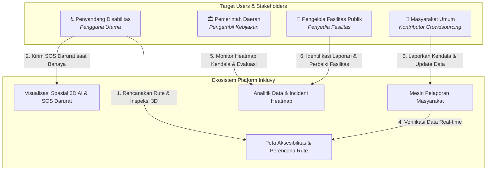
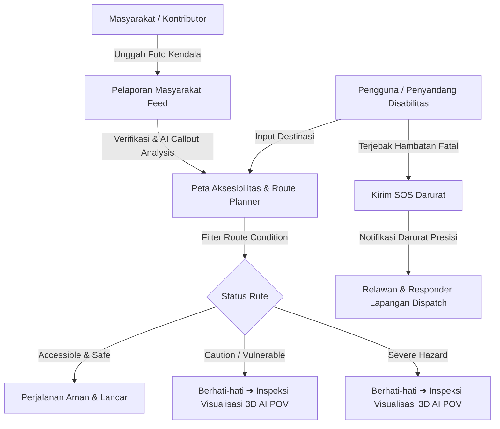

<div align="center">
  <p align="center">
    
    &nbsp;&nbsp;&nbsp;&nbsp;&nbsp;&nbsp;&nbsp;&nbsp;&nbsp;&nbsp;&nbsp;&nbsp;&nbsp;&nbsp;&nbsp;&nbsp;
    
  </p>
  
  # Inkluvy
  ### Platform Navigasi dan Keselamatan Darurat bagi Penyandang Disabilitas di Perkotaan
  
  **Aplikasi Navigasi Inklusif Cerdas Berbasis Crowdsourcing & AI 3D Spatial Visualization**

[](https://citech.polinema.ac.id)
[](https://www.polinema.ac.id)

</div>

---

## 👥 Identitas Tim Pengembang

- **Nama Tim**: `Bu, baguz izin ikut citech 2026`
- **Disusun oleh**:
  1. **Ananda Priya Yustira** (NIM: `244107020131`)
  2. **Bagus Wichaksono Amanulloh** (NIM: `244107020238`)
- **Penyelenggara Kompetisi**: CITECH 2026 (City Technology Competition)
- **Institusi**: Politeknik Negeri Malang
- **Lokasi**: Kota Malang, Jawa Timur
- **Tahun**: 2026

---

## 📌 1. What is Inkluvy? (Tentang Inkluvy)

**Inkluvy** adalah platform navigasi perkotaan ramah disabilitas yang mengintegrasikan pemetaan rute aksesibel, laporan kondisi jalan berbasis _crowdsourcing_, visualisasi spasial 3D interaktif berbasis AI, serta sistem bantuan darurat (_SOS Darurat_) dalam satu ekosistem digital terpadu.

### 📍 Latar Belakang & Masalah

Infrastruktur perkotaan sering kali belum ramah bagi penyandang disabilitas (pengguna kursi roda, tunanetra, lansia, dan orang dengan mobilitas terbatas). Permasalahan utama yang dihadapi meliputi:

- **Informasi Rute yang Tidak Akurat**: Aplikasi peta konvensional tidak menyediakan data spesifik mengenai kelayakan trotoar, ketersediaan rampa, atau lift peron stasiun.
- **Hambatan Lapangan Mendadak**: Galian utilitas tanpa pembatas, ubin pemandu (_tactile block_) terputus, dan rampa kayu darurat yang curam.
- **Resiko Keselamatan**: Tingginya risiko kecelakaan bagi penyandang disabilitas saat menavigasi area berpotensi bahaya tanpa panduan visual/audio.

**Inkluvy hadir sebagai solusi** untuk memberikan kepastian rute sebelum bepergian, memvisualisasikan kondisi nyata secara 360°, serta memberikan respon cepat saat terjadi situasi darurat di jalan.

---

## ✨ 2. Fitur Utama (Core Features)

### 🌐 1. Peta Aksesibilitas (Accessibility Map)

Menampilkan informasi fasilitas aksesibilitas, kondisi rute, serta lokasi permintaan bantuan darurat (Emergency SOS) pada peta interaktif sehingga pengguna dapat memperoleh gambaran aksesibilitas suatu wilayah secara menyeluruh.

- **Accessible & Safe** (`🟢` / `<LuCheck />`): Rampa beton standar, elevator aktif, ubin pengarah utuh.
- **Caution / Vulnerable** (`🟡` / `<LuShieldAlert />`): Rampa kayu sementara, ubin aus, konstruksi ringan.
- **Severe Hazard** (`⛔` / `<LuShieldAlert />` - _Orange Segment_): Galian kabel terbuka, trotoar amblas, jalur terputus.
- **Emergency SOS** (`🚨` / `<LuLifeBuoy />` - _Rose Segment_): Lokasi difabel membutuhkan bantuan darurat langsung dari relawan terdekat.

### 📍 2. Perencana Rute (Route Planner)

Membantu pengguna menentukan rute perjalanan yang mempertimbangkan informasi aksesibilitas sehingga lebih sesuai dengan kebutuhan mobilitas penyandang disabilitas.

### 🚌 3. Informasi Transportasi

Menyediakan informasi mengenai layanan transportasi yang mendukung mobilitas penyandang disabilitas, termasuk halte, terminal, maupun moda transportasi yang memiliki fasilitas aksesibilitas (bus _low-floor_, elevator peron stasiun, dan gerbong prioritas).

### 🕶️ 4. Visualisasi Spasial 3D Berbasis AI (AI 3D Spatial Visualizer)

Memanfaatkan teknologi Artificial Intelligence (AI) untuk menghasilkan visualisasi tiga dimensi sebagai representasi kondisi lingkungan berdasarkan foto yang diunggah pengguna. Visualisasi ini membantu pengguna memperoleh gambaran kondisi aksesibilitas suatu lokasi secara lebih nyata sebelum melakukan perjalanan (seperti kecuraman rampa, pintu lift, dan ubin pengarah).

### 👥 5. Pelaporan Masyarakat (Community Reporting)

Memungkinkan masyarakat berpartisipasi dalam melaporkan perubahan maupun kendala aksesibilitas pada fasilitas publik, baik di area outdoor maupun indoor, sehingga data aksesibilitas pada platform tetap akurat, terkini, dan bermanfaat bagi pengguna lainnya.

### 🚨 6. SOS Darurat (Emergency SOS)

Memungkinkan pengguna mengirimkan informasi lokasi kepada kontak darurat yang telah didaftarkan serta relawan terdekat ketika menghadapi situasi darurat sehingga dapat mendukung proses permintaan bantuan secara cepat.

---

## 🎯 3. Skenario Penggunaan Produk (Target User Scenarios)

Inkluvy dirancang untuk mendukung ekosistem kota inklusif melalui keterlibatan 4 kelompok pemangku kepentingan utama:



### ♿ 1. Penyandang Disabilitas (Pengguna Utama)

Pengguna utama Inkluvy yang memanfaatkan platform untuk memperoleh informasi aksesibilitas fasilitas publik, merencanakan perjalanan yang sesuai dengan kebutuhan mobilitas, serta memperoleh dukungan dalam situasi darurat.

- **Penggunaan**: Mencari rute ramah kursi roda/tunanetra, memvisualisasikan kondisi rampa via 3D POV, dan menekan tombol SOS Darurat saat menemui hambatan fatal.

### 👥 2. Masyarakat Umum (Kontributor Crowdsourcing)

Berperan sebagai kontributor melalui sistem crowdsourcing dengan melaporkan kondisi fasilitas publik dan memperbarui informasi aksesibilitas agar data pada platform tetap akurat dan terkini.

- **Penggunaan**: Mengunggah foto trotoar rusak/galian, memberikan deskripsi kendala, serta melakukan upvote verifikasi pada laporan warga lain.

### 🏛️ 3. Pemerintah Daerah (Pengambil Kebijakan)

Memanfaatkan data hasil pelaporan masyarakat sebagai bahan evaluasi, penyusunan kebijakan, dan penentuan prioritas pembangunan fasilitas publik yang lebih inklusif.

- **Penggunaan**: Memantau peta persebaran kendala jalan (_incident heatmap_) dan menentukan pengalokasian anggaran perbaikan fasilitas transportasi perkotaan.

### 🏢 4. Pengelola Fasilitas Publik (Penyedia Fasilitas)

Menggunakan informasi dan laporan pengguna untuk mengidentifikasi kondisi fasilitas, menentukan prioritas perbaikan, serta meningkatkan kualitas pelayanan dan aksesibilitas fasilitas publik.

- **Penggunaan**: Menerima notifikasi masalah fasilitas di area gedung/terminal yang dikelola dan memperbarui status rampa/lift secara berkala.

---

## 🔄 4. Alur Aplikasi (Application Flow)

Diagram alur keputusan dan navigasi pengguna dalam memanfaatkan fitur Inkluvy:



---

## 🛠️ 5. Detail Technology Stack

| Komponen Platform           | Teknologi / Library                          | Deskripsi Peran & Implementasi                                                                                            |
| :-------------------------- | :------------------------------------------- | :------------------------------------------------------------------------------------------------------------------------ |
| **Core Framework**          | React 18, Vite 8, React Router v7            | Arsitektur Single Page Application (SPA) ultra-cepat dengan perutean dinamis & Hot Module Replacement (HMR).              |
| **3D POV Engine**           | Three.js (`three` r160+)                     | Engine rendering 360° panoramic sphere berbasis _Inverted Geometry_ & _Orbit Controls Damping_ untuk inspeksi spasial AI. |
| **Interactive Mapping**     | MapLibre GL JS, Mapcn Custom Layer           | Renderer peta vektor interaktif dengan dukungan _Custom Polyline Segments_ untuk membedakan rute aman, bahaya, dan SOS.   |
| **Design System & UI**      | TailwindCSS v4, Vanilla CSS Tokens           | CSS Design System modern dengan konsistensi _HSL Color Tokens_, _Glassmorphic Backdrop Blur_, dan respon fleksibel.       |
| **Motion & Animation**      | Framer Motion                                | Animasi mikro interaktif, transisi halaman, serta pergeseran modal sheet yang halus bagi kenyamanan pengguna.             |
| **Icons & Visual System**   | React Icons (`react-icons/lu`), Lucide React | Sistem ikonografi konsisten dengan gaya stroke modern dan pembungkusan gradien (_SectionIcon_).                           |
| **Data & State Management** | React Context API, LocalStorage Hooks        | Manajemen status aplikasi terpusat untuk sinkronisasi rute, filter keamanan, dan pengiriman SOS darurat.                  |

---

## 🚀 6. Getting Started (Cara Menjalankan Project)

### Prasyarat

- Node.js versi 18.x atau lebih baru
- npm v9.x atau lebih baru

### Langkah Instalasi

```bash
# 1. Clone repository
git clone https://github.com/nandaa/inkluvy.git

# 2. Masuk ke direktori project
cd inkluvy

# 3. Install dependencies
npm install

# 4. Jalankan mode pengembangan lokal
npm run dev
```

Aplikasi akan berjalan secara lokal di `http://localhost:5173`.

### Production Build & Verification

```bash
# Uji coba build produksi
npm run build
```

---

## 🏅 Identitas Penyelenggaraan

Project **Inkluvy** disusun dan dikembangkan secara khusus untuk mengikuti kompetisi **CITECH 2026** oleh Mahasiswa Jurusan Teknologi Informasi, **Politeknik Negeri Malang**.

<div align="center">
  <sub>Dedicated to a fully accessible and inclusive smart city for everyone.</sub>
</div>
