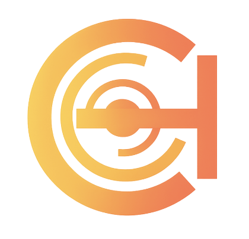
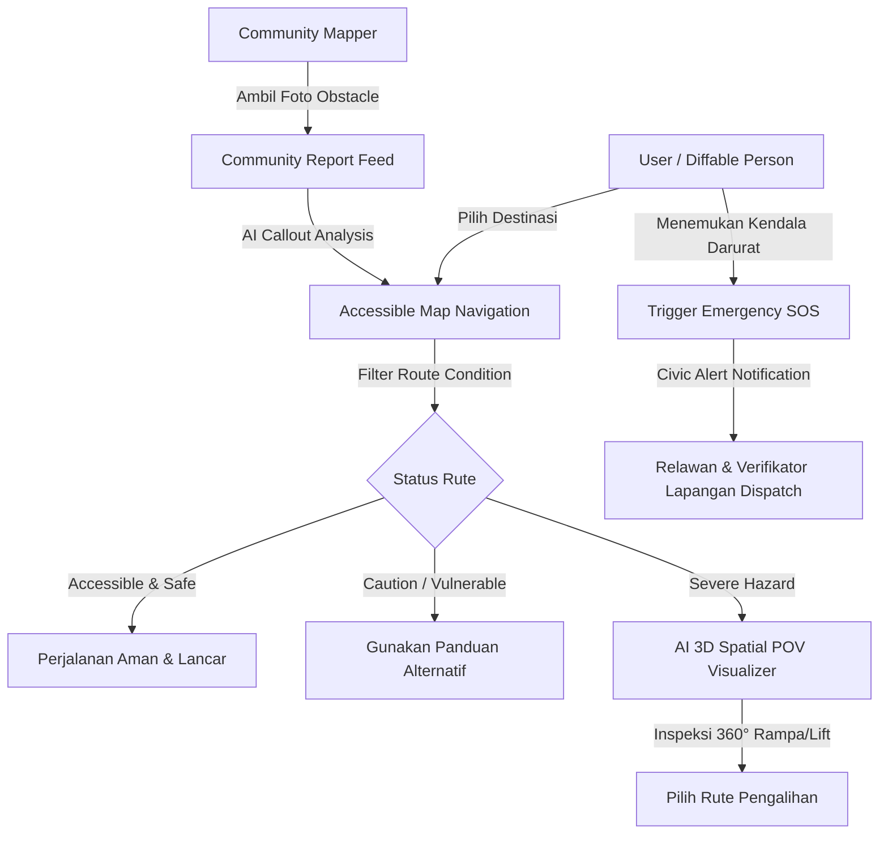

<div align="center">
  <p align="center">
    
    &nbsp;&nbsp;&nbsp;&nbsp;&nbsp;&nbsp;&nbsp;&nbsp;&nbsp;&nbsp;&nbsp;&nbsp;&nbsp;&nbsp;&nbsp;&nbsp;
    
  </p>
  
  # Inkluvy
  ### Platform Navigasi dan Keselamatan Darurat bagi Penyandang Disabilitas di Perkotaan
  
  **Aplikasi Navigasi Inklusif Cerdas Berbasis Crowdsourcing & AI 3D Spatial Visualization**

[](https://citech.polinema.ac.id)

</div>

---

## 👥 Identitas Tim Pengembang

- **Nama Tim**: `Bu, baguz izin ikut citech 2026`
- **Disusun oleh**:
  1. **Ananda Priya Yustira** (NIM: `244107020131`)
  2. **Bagus Wichaksono Amanulloh** (NIM: `244107020238`)
- **Penyelenggara Kompetisi**: CITECH 2026 (City Technology Competition)
- **Institusi**: Politeknik Negeri Malang
- **Lokasi**: Kota Malang, Jawa Timur
- **Tahun**: 2026

---

## 📌 1. What is Inkluvy? (Tentang Inkluvy)

**Inkluvy** adalah platform navigasi perkotaan ramah disabilitas yang mengintegrasikan pemetaan rute aksesibel, laporan kondisi jalan berbasis _crowdsourcing_, visualisasi spasial 3D interaktif, serta sistem bantuan darurat (_SOS Civic Alert_) dalam satu ekosistem digital terpadu.

### 📍 Latar Belakang & Masalah

Infrastruktur perkotaan sering kali belum ramah bagi penyandang disabilitas (pengguna kursi roda, tunanetra, lansia, dan orang dengan mobilitas terbatas). Permasalahan utama yang dihadapi meliputi:

- **Informasi Rute yang Tidak Akurat**: Aplikasi peta konvensional tidak menyediakan data spesifik mengenai kelayakan trotoar, ketersediaan rampa, atau lift peron stasiun.
- **Hambatan Lapangan Mendadak**: Galian utilitas tanpa pembatas, ubin pemandu (_tactile block_) terputus, dan rampa kayu darurat yang curam.
- **Resiko Keselamatan**: Tingginya risiko kecelakaan bagi penyandang disabilitas saat menavigasi area berpotensi bahaya tanpa panduan visual/audio.

**Inkluvy hadir sebagai solusi** untuk memberikan kepastian rute sebelum bepergian, memvisualisasikan kondisi nyata secara 360°, serta memberikan respon cepat saat terjadi situasi darurat di jalan.

---

## ✨ 2. Key Features (Fitur Unggulan)

### 🌐 1. Interactive Accessible Map & Route Condition Filter

Peta navigasi interaktif dengan kategori indikator keselamatan rute yang terverifikasi secara real-time:

- **Accessible & Safe** (`🟢` / `<LuCheck />`): Rampa beton standar, elevator aktif, ubin pengarah utuh.
- **Caution / Vulnerable** (`🟡` / `<LuShieldAlert />`): Rampa kayu sementara, ubin aus, konstruksi ringan.
- **Severe Hazard** (`⛔` / `<LuShieldAlert />` - _Orange Segment_): Galian kabel terbuka, trotoar amblas, jalur terputus.
- **Emergency SOS** (`🚨` / `<LuLifeBuoy />` - _Rose Segment_): Lokasi difabel membutuhkan bantuan darurat langsung dari relawan terdekat.

### 🕶️ 2. AI 3D Spatial POV Visualizer (Panoramic Inspection)

- Menggunakan teknologi **Three.js** 360° imersif (_Inverted Sphere Damping Geometry_).
- Memungkinkan pengguna melihat inspeksi ruang 360° kondisi rampa, lebar pintu lift, dan tekstur jalan berdasarkan foto laporan lapangan sebelum melangkah keluar rumah.

### 🚨 3. One-Tap SOS Civic Emergency Alert

- Tombol darurat _Emergency SOS_ yang langsung menyiarkan posisi koordinat presisi penyandang disabilitas ke jaringan relawan terdekat & verifikator Inkluvy saat terjebak hambatan fatal.

### 👥 4. Crowdsourced Community Feed & Verification

- Forum komunitas warga dan difabel untuk mengunggah laporan foto kondisi jalan, melakukan upvote, berdiskusi, serta memverifikasi keamanan rute.

### 🚌 5. Priority Transit & Multi-modal Guidance

- Panduan integrasi moda transportasi umum (ketersediaan lift peron stasiun, gerbong prioritas, dan layanan _Accessible Ride_).

---

## 🔄 3. Application Flow & Architecture (Alur Aplikasi)



---

## 🛠️ 4. Technology Stack

| Component              | Technology / Library                         |
| :--------------------- | :------------------------------------------- |
| **Core Framework**     | React 18, Vite 8, React Router v7            |
| **3D Engine**          | Three.js (`three`) — 360° Panoramic Renderer |
| **Interactive Map**    | MapLibre GL, Mapcn Custom Layer Engine       |
| **Styling & UI**       | TailwindCSS v4, Vanilla CSS Design System    |
| **Motion & Animation** | Framer Motion                                |
| **Icons & Visuals**    | React Icons (`react-icons/lu`), Lucide React |

---

## 🚀 5. Getting Started (Cara Menjalankan Project)

### Prasyarat

- Node.js versi 18.x atau lebih baru
- npm v9.x atau lebih baru

### Langkah Instalasi

```bash
# 1. Clone repository
git clone https://github.com/nandaa/inkluvy.git

# 2. Masuk ke direktori project
cd inkluvy

# 3. Install dependencies
npm install

# 4. Jalankan mode pengembangan lokal
npm run dev
```

Aplikasi akan berjalan secara lokal di `http://localhost:5173`.

### Production Build & Verification

```bash
# Uji coba build produksi
npm run build
```

---

## 🏅 Identitas Penyelenggaraan

Project **Inkluvy** disusun dan dikembangkan secara khusus untuk mengikuti kompetisi **CITECH 2026** oleh Mahasiswa Jurusan Teknologi Informasi, **Politeknik Negeri Malang**.

<div align="center">
  <sub>Dedicated to a fully accessible and inclusive smart city for everyone.</sub>
</div>
